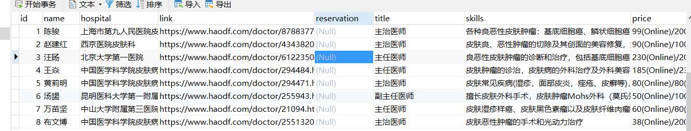

# SkinCancerDetect

## 模型路径

放在D:\Models下，现有两个模型：model2.h5，model3.hdf5

## 数据库

已连接，配置在config.py

# 预测

app.py调用predict_2.py，predict_3.py

# 已加入接口

### /upload

上传图片，路径存储在./static/predict_image/unpredict中

### /predict

通过两个模型进行预测，两个模型返回的是预测的名字，接口返回的是json数据，后续根据要求进行更改（预测对numpy的版本有要求：1.19.2，tensorflow的版本是2.5.0，其他版本是否支持不确定）

### /market

展示数据库中的存储的几个医生的数据，链接在doctor类中的link属性里，展示的是医生信息，预约的链接7.10晚上增加，并增加

数据库现在的状态：

